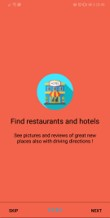
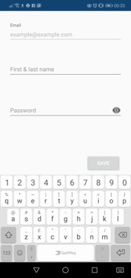
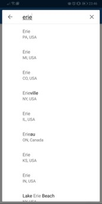
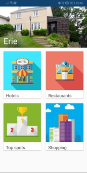
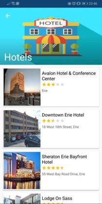
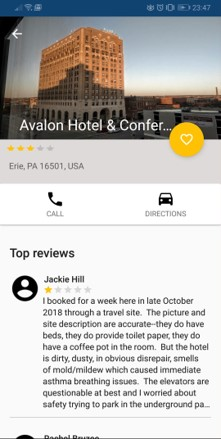

# TravelSmart
Travel Smart makes exploring tourist destination easier by providing searched lists of great restaurants, hotels, popular attractions and fun things to do in City.

# User Interface
 

# API
Google Place API using Firebase

# Photos
Google Photos
